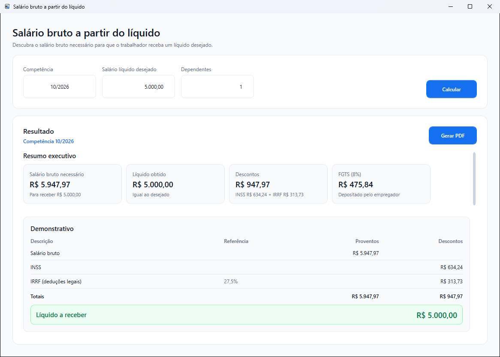
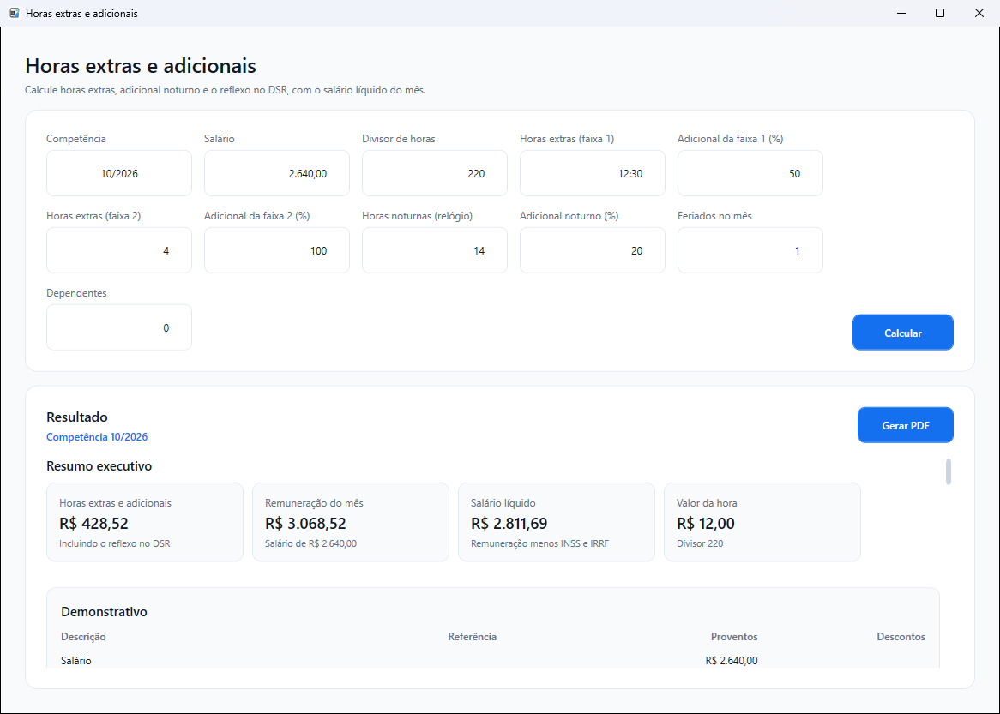
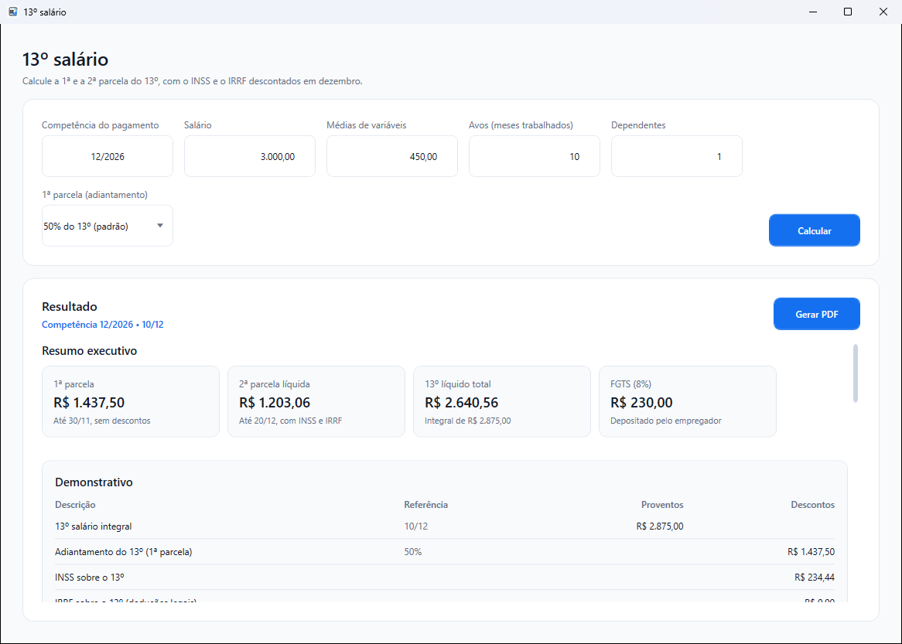
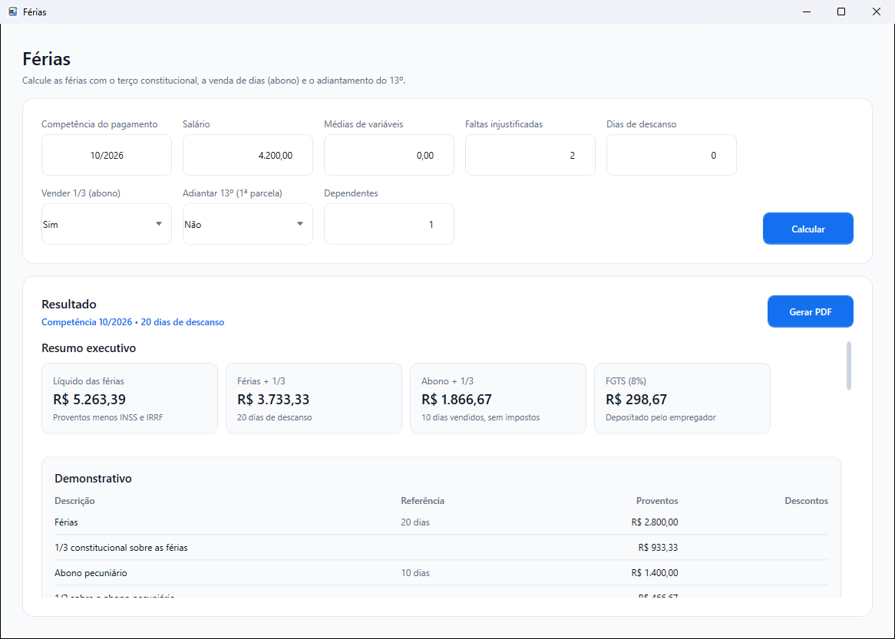
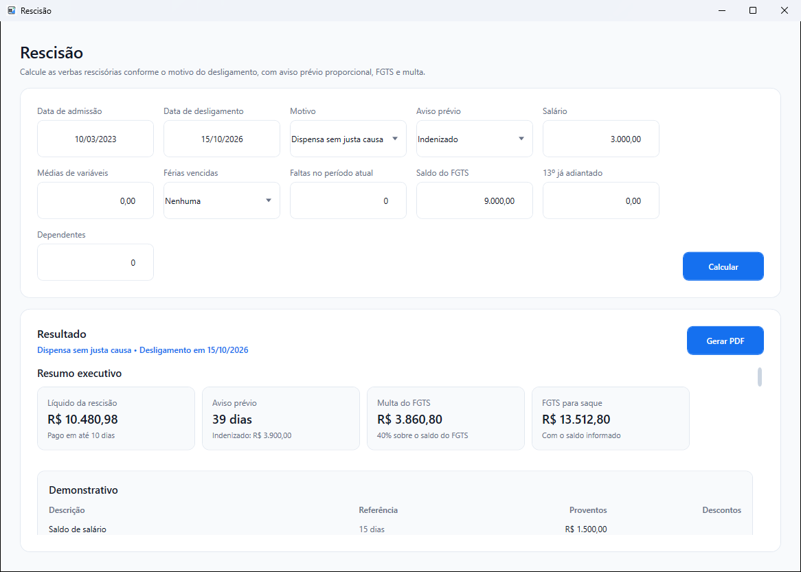
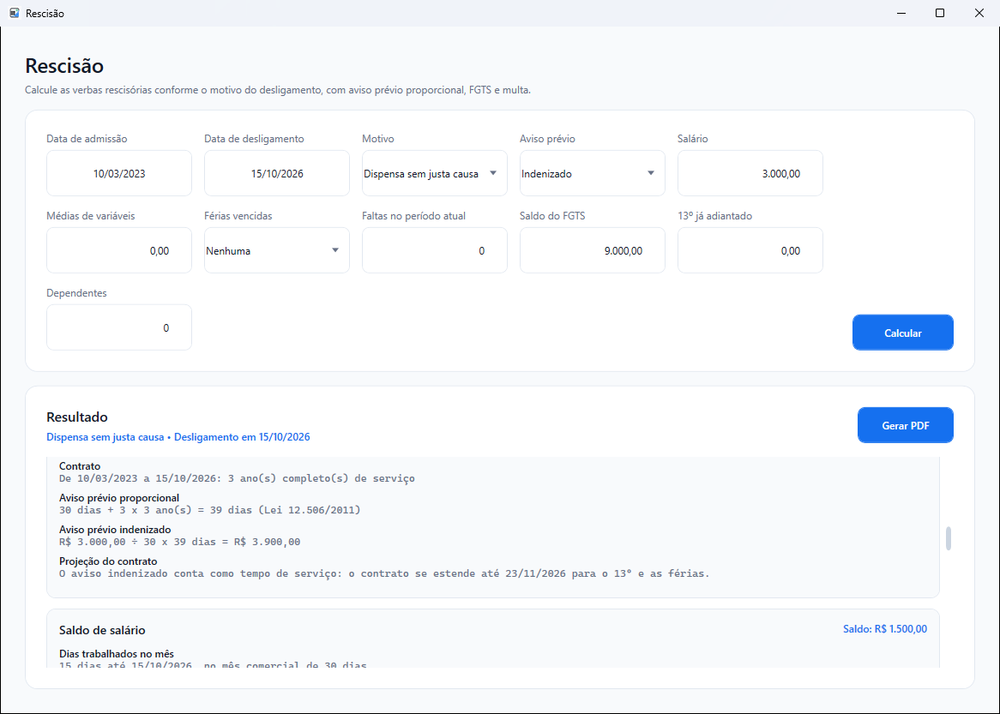
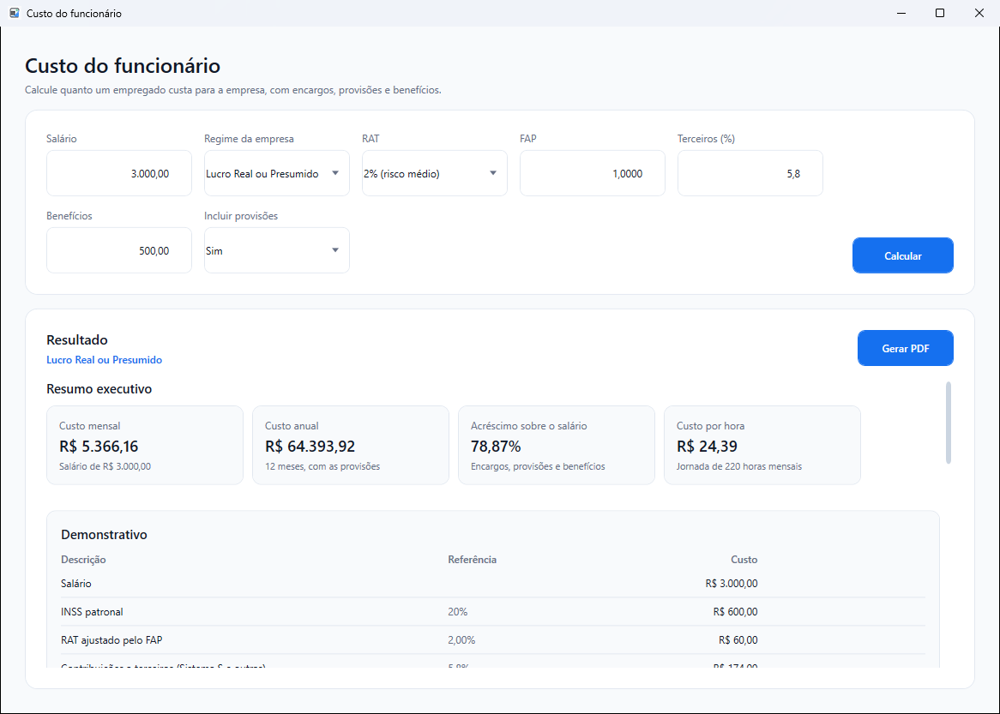
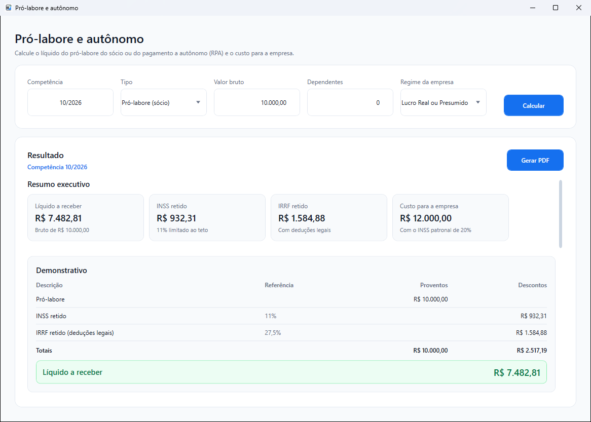

# Manual do Usuário — Calculadora de Imposto

Guia completo para utilizar a **Calculadora de Imposto**: simulação de IRRF, INSS e FGTS, salário líquido, férias, 13º salário, horas extras, rescisão, custo do funcionário, pró-labore, pensão alimentícia, indenização de estabilidade e manutenção das tabelas tributárias.

> **Atenção:** os resultados têm caráter de **simulação**. Confira sempre os valores com a legislação vigente e com os dados reais do vínculo antes de utilizá-los em folha de pagamento, rescisões ou decisões legais.

## Sumário

1. [Apresentação](#1-apresentação)
2. [Antes de começar](#2-antes-de-começar)
3. [Conhecendo a tela principal](#3-conhecendo-a-tela-principal)
4. [Regras de preenchimento](#4-regras-de-preenchimento)
5. [Simulação tributária](#5-simulação-tributária)
6. [Cálculo de pensão alimentícia](#6-cálculo-de-pensão-alimentícia)
7. [Cálculo de estabilidade](#7-cálculo-de-estabilidade)
8. [Calculadoras trabalhistas](#8-calculadoras-trabalhistas)
9. [Tabelas e parâmetros](#9-tabelas-e-parâmetros)
10. [Relatórios em PDF](#10-relatórios-em-pdf)
11. [Tema e configurações](#11-tema-e-configurações)
12. [Mensagens e solução de problemas](#12-mensagens-e-solução-de-problemas)
13. [Perguntas frequentes](#13-perguntas-frequentes)
14. [Atalhos de teclado](#14-atalhos-de-teclado)

## 1. Apresentação

A Calculadora de Imposto reúne, em um único aplicativo para Windows, os cálculos trabalhistas e tributários mais comuns do dia a dia:

- **Simulação tributária:** IRRF pelas modalidades normal e simplificada, INSS por faixas, salário líquido e FGTS de 8% e de 2% (Jovem Aprendiz), com indicação da modalidade de IRRF mais vantajosa.
- **Calculadoras trabalhistas:** salário bruto a partir do líquido, horas extras com adicional noturno e DSR, 13º salário, férias com abono, rescisão por motivo de desligamento, custo do funcionário para a empresa e pró-labore ou pagamento a autônomo (RPA).
- **Pensão alimentícia:** cálculo da pensão e do IRRF considerando que a pensão reduz a base do imposto, nas duas modalidades.
- **Estabilidade:** indenização do período de estabilidade restante, com 13º salário, férias, adicional de 1/3, FGTS e multa de 40%.
- **Tabelas e parâmetros:** consulta e manutenção das faixas de INSS e IRRF e dos valores usados nos cálculos, com atualização pela internet a partir das fontes oficiais e de fontes alternativas que publicam as tabelas antes.

Todos os cálculos são feitos **no seu computador**. Os dados digitados não são enviados para nenhum servidor; a internet só é usada quando você pede a atualização das tabelas.

## 2. Antes de começar

### Requisitos

- Windows 10 ou superior, 64 bits.

Não é preciso instalar o .NET nem outro componente: o instalador já inclui tudo o que o aplicativo usa.

### Instalando

1. Na página de [versões do projeto](https://github.com/mayconwisley/CalculoIRRF/releases/latest), baixe o arquivo **CalculadoraDeImposto-X.Y.Z-setup.exe**, em *Assets*.
2. Execute o instalador e siga as etapas. Se quiser, marque a opção de criar um atalho na área de trabalho.
3. Ao final, deixe marcada a opção de abrir a Calculadora de Imposto.

A instalação é feita apenas para o seu usuário, na pasta `%LOCALAPPDATA%\Programs\Calculadora de Imposto`, e não pede permissão de administrador.

> **Aviso do Windows:** como o instalador não é assinado digitalmente, o Windows pode exibir a tela "O Windows protegeu o computador" (SmartScreen). Selecione **Mais informações** e depois **Executar assim mesmo**.

### Abrindo o aplicativo

Abra a **Calculadora de Imposto** pelo Menu Iniciar ou pelo atalho da área de trabalho. A janela principal, **Central de cálculos**, é aberta já com a competência do mês atual preenchida. A versão instalada aparece no rodapé da janela.

Na primeira execução, o aplicativo prepara o banco de dados local com as tabelas históricas de INSS e IRRF. Esse processo é automático e acontece uma única vez.

### Atualizando e desinstalando

Para atualizar, baixe e execute o instalador da nova versão: ele substitui a versão anterior, fechando o aplicativo se estiver aberto. As tabelas que você incluiu ou alterou são **preservadas**.

Para remover, use **Configurações do Windows > Aplicativos > Aplicativos instalados > Calculadora de Imposto > Desinstalar**. O banco com as suas tabelas (`BancoDados\calculoIrrf.db`, na pasta de instalação) é mantido, para que uma reinstalação recupere os dados. Se não quiser mantê-lo, apague a pasta `%LOCALAPPDATA%\Programs\Calculadora de Imposto` depois de desinstalar.

## 3. Conhecendo a tela principal

| Nº | Área | Para que serve |
| --- | --- | --- |
| 1 | Cabeçalho | Identifica a Central de cálculos. Ao lado ficam o seletor de **Tema** e o botão do manual. |
| 2 | Manual do usuário | Abre este manual. Também pode ser aberto com a tecla **F1** em qualquer janela. |
| 3 | Dados da simulação | Competência, valor bruto, base de INSS e quantidade de dependentes. |
| 4 | Calcular | Executa a simulação tributária com os dados informados. |
| 5 | Calculadoras | Acesso às demais calculadoras: pensão alimentícia, salário bruto a partir do líquido, horas extras, 13º salário, férias, rescisão, estabilidade, custo do funcionário e pró-labore. Veja a seção [Calculadoras trabalhistas](#8-calculadoras-trabalhistas). |
| 6 | Tabelas e parâmetros | Acesso às tabelas de INSS, IRRF e aos parâmetros usados nos cálculos. Role a barra lateral para ver todas. |
| 7 | Resultado da simulação | Mostra o resumo, o comparativo e a memória de cálculo depois de calcular. |
| 8 | Gerar PDF | Salva o resultado em um relatório PDF. Fica disponível depois do primeiro cálculo. |

Enquanto nenhum cálculo foi feito, a área de resultado exibe uma orientação sobre o que preencher.

## 4. Regras de preenchimento

Estas regras valem para todas as telas do aplicativo:

- **Competência:** informe mês e ano no formato **MM/AAAA**, por exemplo `10/2026`.
- **Datas:** informe no formato **dd/MM/aaaa**, por exemplo `02/10/2026`.
- **Valores em reais:** use vírgula para os centavos, como em `8500,00` ou `8.500,00`. O ponto de milhar é opcional.
- **Formatação automática:** ao entrar em um campo de valor que está zerado, ele é limpo para você digitar. Ao sair do campo, o valor é formatado com duas casas decimais (`8.500,00`). Se você deixar o campo vazio, ele volta para `0,00`.
- **Navegação:** use a tecla **Tab** para avançar entre os campos e **Shift + Tab** para voltar.

Se algum dado estiver em formato inválido, o aplicativo exibe um aviso e não faz o cálculo. Veja exemplos na seção [Mensagens e solução de problemas](#12-mensagens-e-solução-de-problemas).

## 5. Simulação tributária

### 5.1 Preenchendo os dados

1. Em **Competência**, confirme ou altere o mês de referência. As tabelas usadas no cálculo são as vigentes nessa competência.
2. Em **Valor bruto**, informe o total de rendimentos tributáveis do mês.
3. **Base de INSS** é preenchida automaticamente com o valor bruto. Altere somente se a base de contribuição for diferente do valor bruto.
4. Em **Dependentes**, informe a quantidade de dependentes para fins de IRRF (número inteiro, zero ou maior).
5. Clique em **Calcular**.

### 5.2 Lendo o resultado

1. **Resumo executivo:** cartões com os principais valores. São eles o valor bruto, o INSS com a base considerada, o IRRF nas duas modalidades com a alíquota efetiva de cada uma, o **salário líquido** (valor bruto menos o INSS e o menor IRRF) e o FGTS de 8% e de 2%.
2. **Comparação entre modalidades:** base de cálculo, redução mensal e IRRF final da modalidade normal e da simplificada.
3. **Mais vantajoso:** destaca a modalidade com o menor IRRF. Quando as duas resultam no mesmo valor, nenhuma é destacada.
4. **Gerar PDF:** salva o resultado completo em um relatório.

Role a área de resultado para ver a **memória de cálculo**, que mostra passo a passo como cada valor foi obtido:

Para cada modalidade de IRRF são exibidos:

- **Base de cálculo:** o valor sobre o qual o imposto incide, com cada dedução identificada. Na modalidade normal, o valor bruto menos o INSS e a dedução por dependente multiplicada pela quantidade de dependentes; na simplificada, o valor bruto menos o desconto simplificado. A base nunca fica negativa: quando as deduções superam o valor bruto, ela é zero.
- **IR progressivo:** base × alíquota da faixa − parcela a deduzir.
- **Redução mensal:** desconto aplicado ao imposto, quando previsto para a competência.

No final da área de resultado aparece o detalhamento **faixa a faixa** do INSS e do IRRF:

### 5.3 Como os valores são calculados

| Item | Regra aplicada pelo aplicativo |
| --- | --- |
| INSS | A partir de 03/2020, cálculo progressivo: cada parte da base é tributada pela alíquota da sua faixa. Antes de 03/2020, alíquota única conforme a faixa em que a base se encontra. A base é limitada ao teto da tabela (último limite cadastrado). |
| IRRF normal | Base = valor bruto − INSS − (dependentes × dedução por dependente). |
| IRRF simplificado | Base = valor bruto − desconto simplificado. Disponível a partir de 05/2023. |
| Redução mensal | Quando cadastrada para a competência, reduz o imposto apurado conforme a faixa de rendimentos (por exemplo, as regras vigentes a partir de 01/2026). |
| Alíquota efetiva | IRRF final ÷ valor bruto. |
| Salário líquido | Valor bruto − INSS − IRRF da modalidade mais vantajosa, que é a aplicada pela fonte pagadora. |
| FGTS | 8% (padrão) e 2% (Jovem Aprendiz) sobre toda a base de INSS informada. O FGTS não tem teto: diferentemente do INSS, ele não é limitado ao último limite da tabela. |

> **Importante:** o aplicativo utiliza, para cada tabela, o registro mais recente cuja competência seja **igual ou anterior** à competência informada. Por exemplo, uma simulação de 10/2026 usa as faixas de INSS de 01/2026, se essa for a tabela mais recente até essa data.

## 6. Cálculo de pensão alimentícia

O botão **Calcular pensão** fica disponível depois que você faz uma simulação tributária na tela principal. A pensão usa a competência, o valor bruto, a base de INSS e os dependentes informados na simulação.

### 6.1 Calculando

1. Em **Percentual da pensão**, informe o percentual definido em decisão ou acordo (de 0 a 100), por exemplo `30,00`.
2. **Resumo** calcula e mostra o resumo executivo e o comparativo entre as modalidades.
3. **Detalhar** faz o mesmo cálculo e inclui a memória de cálculo de cada iteração.
4. **Comparação entre modalidades:** IRRF final, pensão e total (IRRF + pensão) nas modalidades normal e simplificada.

O campo **Rendimentos** traz o valor bruto da simulação e não pode ser editado nesta tela. Em **Outros descontos**, informe valores que devem ser retirados dos rendimentos antes do cálculo; eles não podem ser maiores que os rendimentos.

### 6.2 Por que o cálculo é feito em iterações

A pensão alimentícia é dedutível da base do IRRF, mas o próprio IRRF reduz o valor sobre o qual a pensão é calculada. Por isso o aplicativo repete o cálculo até que o valor da pensão se estabilize, com diferença de até R$ 0,01 entre duas iterações. Em cada iteração:

1. A base do IRRF é recalculada descontando a pensão encontrada na iteração anterior.
2. O IRRF é apurado pela tabela progressiva e pela redução mensal, quando houver.
3. A base da pensão é calculada como rendimentos − INSS − IRRF.
4. A nova pensão é calculada aplicando o percentual sobre essa base.

A modalidade mais vantajosa é a que resulta no **menor total** (IRRF + pensão).

## 7. Cálculo de estabilidade

Acesse **Cálculo de estabilidade** no menu **Calculadoras**.

| Nº | Campo | O que informar |
| --- | --- | --- |
| 1 | Média remuneratória | Média da remuneração usada como referência para a indenização. |
| 2 | Dias-base | Divisor para obter o valor diário da média. O padrão é 30. |
| 3 | Data de demissão | Data do desligamento (dd/MM/aaaa). |
| 4 | Fim da estabilidade | Último dia do período de estabilidade (dd/MM/aaaa). Deve ser posterior à demissão. |
| 5 | Complementos | Valores adicionais a somar no total, se houver. |
| 6 | Resultado da apuração | Mostra, enquanto você digita as datas, quantos dias de estabilidade restam. |

Clique em **Calcular** para ver o resumo e a memória de cálculo:

| Verba | Regra aplicada |
| --- | --- |
| Indenização | Média ÷ dias-base × dias de estabilidade. |
| Avos | Um avo a cada 30 dias de estabilidade, mais um avo quando a sobra for de 15 dias ou mais. |
| 13º salário | Média ÷ 12 × avos. |
| Férias proporcionais | Média ÷ 12 × avos. |
| Adicional de férias | Férias ÷ 3. |
| FGTS | (Indenização + 13º salário) × 8%. |
| Multa do FGTS | FGTS × 40%. |
| Total estimado | Soma das verbas + complementos. |

O botão **Gerar PDF** cria um demonstrativo com as verbas, os dados considerados e o **Total a receber**.

## 8. Calculadoras trabalhistas

Além da simulação tributária, o menu **Calculadoras** tem sete calculadoras para o dia a dia do departamento pessoal. Todas usam a mesma janela:

- **Formulário:** os campos do cálculo. Passe o mouse sobre um campo para ver uma dica do que informar. Ao abrir uma calculadora, a competência, o valor bruto e os dependentes digitados na tela principal já vêm preenchidos. Alguns campos só aparecem quando a opção escolhida em outro campo exige.
- **Calcular:** faz o cálculo. A tecla **Enter** também calcula.
- **Resumo executivo:** os valores mais importantes.
- **Demonstrativo:** proventos, descontos e o resultado, como em um holerite.
- **Valores informativos:** valores que não são pagos ao trabalhador, como o FGTS.
- **Memória de cálculo:** a fórmula de cada valor, inclusive o INSS faixa a faixa e o IRRF nas duas modalidades.
- **Observações:** as premissas e os limites do cálculo.
- **Gerar PDF:** salva o demonstrativo completo.

O INSS e o IRRF seguem as mesmas regras da simulação tributária, com as tabelas da competência informada: o IRRF aplica a modalidade mais vantajosa para o trabalhador (deduções legais ou desconto simplificado) e a redução mensal, quando prevista.

### 8.1 Salário bruto a partir do líquido

Informe o **salário líquido desejado** e os **dependentes**. O aplicativo procura, por aproximações sucessivas, o salário bruto que, descontados o INSS e o IRRF, resulta nesse líquido. A memória de cálculo mostra a conferência: bruto − INSS − IRRF = líquido.

> **Dica:** para considerar descontos fixos, como vale-transporte ou plano de saúde, some-os ao líquido desejado.

Em raros casos, o arredondamento em centavos impede chegar exatamente ao valor. O aplicativo mostra então o líquido mais próximo e a diferença.

### 8.2 Horas extras e adicionais

| Campo | O que informar |
| --- | --- |
| Salário | Salário mensal. |
| Divisor de horas | 220 para 44 horas semanais; 200 para 40; 180 para 36; 150 para 30. |
| Horas extras (faixas 1 e 2) | Horas no formato `10:30` ou `10,5`, com o adicional de cada faixa. O mínimo é 50%; para domingos e feriados, normalmente 100%. |
| Horas noturnas (relógio) | Horas de relógio trabalhadas entre 22h e 5h. |
| Adicional noturno (%) | 20% para o trabalho urbano. |
| Feriados no mês | Feriados em dias úteis, usados no DSR. |

- **Valor da hora:** salário ÷ divisor.
- **Hora extra:** valor da hora × (1 + adicional) × horas.
- **Adicional noturno:** a hora noturna tem 52 minutos e 30 segundos, então 7 horas de relógio valem 8 horas noturnas. O adicional é valor da hora × percentual × horas noturnas.
- **DSR:** (horas extras + adicional noturno) ÷ dias úteis do mês × (domingos + feriados).
- O INSS e o IRRF incidem sobre a remuneração total do mês, e o resultado mostra o salário líquido.

### 8.3 13º salário

| Campo | O que informar |
| --- | --- |
| Competência do pagamento | Mês da 2ª parcela, normalmente 12/AAAA. |
| Salário e Médias de variáveis | Salário de dezembro e a média anual de horas extras, comissões e adicionais. |
| Avos | Meses do ano com 15 dias ou mais de trabalho, de 1 a 12. |
| 1ª parcela | **50% do 13º**, **Não houve adiantamento** ou **Valor informado**. Na última opção aparece o campo **Valor da 1ª parcela**. |

- **13º integral:** (salário + médias) ÷ 12 × avos.
- **1ª parcela:** paga até 30/11, sem descontos.
- **2ª parcela:** integral − 1ª parcela − INSS − IRRF, paga até 20/12.
- O INSS e o IRRF são calculados sobre o 13º integral, à parte do salário de dezembro.

### 8.4 Férias

| Campo | O que informar |
| --- | --- |
| Salário e Médias de variáveis | Salário na data das férias e a média de variáveis do período aquisitivo. |
| Faltas injustificadas | Faltas no período aquisitivo, que definem os dias de direito (tabela abaixo). |
| Dias de descanso | Deixe 0 para usar todos os dias de direito que não forem vendidos; informe menos para dividir as férias (mínimo de 5 dias). |
| Vender 1/3 (abono) | Converte 1/3 dos dias em dinheiro, por exemplo 10 de 30 dias. |
| Adiantar 13º (1ª parcela) | Paga metade do 13º junto com as férias. |

| Faltas no período aquisitivo | Dias de férias |
| --- | --- |
| Até 5 | 30 |
| De 6 a 14 | 24 |
| De 15 a 23 | 18 |
| De 24 a 32 | 12 |
| Mais de 32 | Sem direito |

- **Férias:** (salário + médias) ÷ 30 × dias de descanso, mais o terço constitucional.
- **Abono pecuniário:** os dias vendidos, também com 1/3. Não tem INSS, IRRF nem FGTS.
- O INSS e o IRRF incidem sobre as férias + 1/3. O IRRF é calculado à parte dos demais rendimentos do mês; o INSS foi calculado só sobre as férias, e na folha ele é somado ao do salário do mês, até o teto.

### 8.5 Rescisão

| Campo | O que informar |
| --- | --- |
| Data de admissão e Data de desligamento | Início do contrato e último dia trabalhado. Com aviso trabalhado, o último dia do aviso. |
| Motivo | Dispensa sem justa causa, pedido de demissão, acordo (CLT, art. 484-A), dispensa por justa causa ou fim de contrato a prazo. |
| Aviso prévio | Aparece nos motivos que têm aviso: **Indenizado**, **Trabalhado ou dispensado** ou, no pedido de demissão, **Não cumprido (descontar)**. |
| Salário e Médias de variáveis | Último salário e a média de variáveis, que entra no aviso, no 13º e nas férias. |
| Férias vencidas | Períodos completos cujas férias não foram tiradas (até 2). |
| Faltas no período atual | Faltas injustificadas no período aquisitivo em curso, que reduzem as férias proporcionais. |
| Saldo do FGTS | Aparece quando há multa ou saque. Informe o saldo do extrato; com 0,00, o aplicativo estima o saldo pelo salário atual. |
| 13º já adiantado | 1ª parcela do 13º paga no ano, que é descontada. |

| Verba | Sem justa causa | Pedido de demissão | Acordo | Justa causa | Fim de contrato a prazo |
| --- | --- | --- | --- | --- | --- |
| Saldo de salário | Sim | Sim | Sim | Sim | Sim |
| Aviso prévio indenizado | Proporcional | Descontado, se não cumprido | Metade | Não | Não |
| 13º proporcional | Sim | Sim | Sim | Não | Sim |
| Férias vencidas + 1/3 | Sim | Sim | Sim | Sim | Sim |
| Férias proporcionais + 1/3 | Sim | Sim | Sim | Não | Sim |
| Multa do FGTS | 40% | Não | 20% | Não | Não |
| Saque do FGTS | 100% | Não | 80% | Não | 100% |

- **Aviso prévio proporcional:** 30 dias mais 3 por ano completo de serviço, até 90 dias (Lei 12.506/2011). No acordo, é pago pela metade.
- **Projeção do aviso:** o aviso indenizado conta como tempo de serviço. O contrato é projetado até o fim do aviso, e os avos a mais de 13º e de férias aparecem nas linhas "sobre o aviso prévio indenizado".
- **13º proporcional:** um avo para cada mês do ano com 15 dias ou mais de trabalho.
- **Férias proporcionais:** um avo por mês desde o último aniversário da admissão, contando a fração de 15 dias ou mais, reduzidas conforme as faltas.
- **Impostos:** o saldo de salário e o 13º têm INSS e IRRF, cada um calculado à parte. Aviso indenizado, férias indenizadas e multa do FGTS são isentos.
- **FGTS:** o depósito do mês é de 8% sobre o saldo de salário, o aviso indenizado e o 13º. A multa incide sobre o saldo do FGTS mais esse depósito.

A memória de cálculo detalha o contrato, o aviso, a projeção, cada verba e o FGTS:

> **Atenção:** a rescisão deve ser paga em até 10 dias após o fim do contrato (CLT, art. 477, § 6º). O cálculo não inclui férias vencidas em dobro, horas extras e adicionais do mês, descontos de benefícios nem verbas previstas em convenção coletiva.

### 8.6 Custo do funcionário

Informe o **salário**, o **regime da empresa**, o **RAT** e o **FAP**, as **contribuições a terceiros**, o custo mensal com **benefícios** (já descontada a parte do empregado) e se deseja **incluir as provisões** de 13º e férias.

| Encargo | Lucro Real ou Presumido | Simples (anexos I a III e V) | Simples (anexo IV) |
| --- | --- | --- | --- |
| INSS patronal (20%) | Sim | Incluído no DAS | Sim |
| RAT ajustado pelo FAP | Sim | Incluído no DAS | Sim |
| Terceiros (normalmente 5,8%) | Sim | Não | Não |
| FGTS (8%) | Sim | Sim | Sim |

- **Provisões:** 13º = salário ÷ 12; férias + 1/3 = salário ÷ 12 × 4/3. Os encargos também incidem sobre elas.
- O resultado mostra o custo mensal, o custo anual, o acréscimo sobre o salário e o custo por hora, numa jornada de 220 horas.

### 8.7 Pró-labore e autônomo

Escolha o **tipo**, **pró-labore** do sócio ou **autônomo (RPA)**, e informe o valor bruto, os dependentes e o regime da empresa. Para o autônomo, aparece o campo **ISS retido (%)**, usado quando a lei do município exige a retenção.

- **INSS:** 11% do valor, limitado ao teto do INSS.
- **IRRF:** tabela mensal, com a dedução do INSS e dos dependentes ou o desconto simplificado, o que for mais vantajoso.
- **Custo para a empresa:** valor bruto mais o INSS patronal de 20%, exceto no Simples Nacional, anexos I a III e V.
- Pró-labore e RPA não têm FGTS, 13º nem férias.

## 9. Tabelas e parâmetros

As tabelas definem as faixas e os valores usados em todos os cálculos. Elas já vêm preenchidas com o histórico desde 2017, e você pode consultá-las, corrigi-las, incluir novos períodos ou atualizá-las pela internet.

### 9.1 Conhecendo a janela de uma tabela

| Nº | Elemento | Função |
| --- | --- | --- |
| 1 | Formulário | Campos do registro: competência e os valores da tabela aberta. Só aparecem os campos que a tabela usa. |
| 2 | Incluir registro / Salvar alteração | Grava o formulário. O nome do botão indica o que vai acontecer: **Incluir registro** cria um registro novo; **Salvar alteração** atualiza a linha selecionada. |
| 3 | Lista de registros | Registros cadastrados, do mais recente para o mais antigo. |
| 4 | Novo registro | Limpa a seleção e o formulário para você incluir um registro. |
| 5 | Recarregar lista | Lê novamente os registros do banco, mantendo a linha selecionada. Alterações digitadas e não salvas são descartadas. |
| 6 | Excluir selecionado | Remove a linha selecionada. Fica desabilitado quando nenhuma linha está selecionada. |
| 7 | Atualizar pela internet | Busca a tabela mais recente na fonte oficial e em fontes alternativas e grava no banco local. Veja a seção 9.3. |
| 8 | Abrir página oficial | Abre no navegador a página oficial consultada na atualização. |

### 9.2 Incluindo, editando e excluindo registros

O botão de gravação muda de nome conforme a situação, para deixar claro o que será feito:

- **Incluir um registro:** clique em **Novo registro**, preencha o formulário e clique em **Incluir registro**. O registro criado aparece na lista já selecionado.
- **Editar um registro:** clique na linha desejada. Os valores são copiados para o formulário e o botão passa a se chamar **Salvar alteração**. Altere o que for necessário e clique nele; a linha continua selecionada com os valores atualizados.
- **Excluir:** selecione a linha e clique em **Excluir selecionado**. Depois da exclusão, o formulário volta ao modo de inclusão.

> **Dica:** se uma linha selecionada deixar de existir, por exemplo quando a atualização pela internet substitui a tabela da competência, o formulário é limpo e volta ao modo **Incluir registro**. Assim, valores antigos nunca ficam no formulário sem uma linha correspondente.

As alterações passam a valer imediatamente para os próximos cálculos.

### 9.3 Atualizando pela internet

Clique em **Atualizar pela internet** com o computador conectado à internet. O aplicativo consulta ao mesmo tempo a fonte oficial e duas fontes alternativas, valida os valores encontrados e só então grava os dados. Ao final, a mensagem abaixo da lista informa a competência importada, de onde ela veio e a quantidade de faixas:

| Tabela | Fonte oficial | Fontes alternativas |
| --- | --- | --- |
| Tabela INSS | Página de contribuição mensal do INSS (gov.br) | debit.com.br e contabeis.com.br |
| Tabela IRRF, Valor simplificado, Dedução por dependente e Redução mensal do IRRF | Página de tabelas da Receita Federal | debit.com.br e contabeis.com.br |
| Desconto mínimo | Não possui atualização online; mantenha-o manualmente. | — |

**Por que fontes alternativas?** No começo do ano, esses sites costumam publicar as novas tabelas antes das páginas do governo. Para a calculadora não ficar atrasada sem abrir mão da segurança, a atualização segue estas regras:

- A tabela da fonte oficial é usada sempre que for a mais recente.
- Uma competência mais nova que a da fonte oficial só é importada quando **as duas** fontes alternativas trazem exatamente os mesmos valores. Se apenas uma delas publicou a tabela nova, ou se as duas divergem, ela não é gravada, e a mensagem avisa qual fonte já a mostra.
- A mensagem sempre informa a origem dos dados, por exemplo: "Dados de 01/2027 atualizados por debit.com.br e contabeis.com.br, que já publicaram a tabela (4 faixas tributárias importadas). A página oficial ainda mostra a tabela de 01/2026."

**Particularidades do IRRF:** a Receita Federal publica de uma só vez as faixas, o desconto simplificado, a dedução por dependente e a redução mensal. Por isso, em qualquer uma dessas telas, a atualização importa todos esses valores da competência publicada. As fontes alternativas publicam apenas as faixas. Quando a tabela vem delas, o desconto simplificado é calculado em 25% do limite da faixa isenta, como determina a lei, e a dedução por dependente e a redução mensal continuam com os valores já cadastrados. Quando a Receita Federal publicar a tabela, atualize novamente para conferir esses valores.

Se nenhuma tabela puder ser confirmada, por exemplo sem conexão ou com páginas fora do ar, a atualização é cancelada **sem alterar nenhum dado local**, e uma mensagem explica o que aconteceu com cada fonte.

### 9.4 As tabelas disponíveis

**Tabela INSS:** faixa, limite da base e alíquota de cada faixa por competência.

**Tabela IRRF:** faixa, limite da base, alíquota e parcela a deduzir. A última faixa usa um limite muito alto para representar "acima de".

**Redução mensal do IRRF:** faixas de rendimentos com o multiplicador e o valor-base da redução aplicada ao imposto. Nas regras vigentes a partir de 01/2026, por exemplo:

- rendimentos de até R$ 5.000,00 têm redução de até R$ 312,89;
- de R$ 5.000,01 a R$ 7.350,00, a redução é de R$ 978,62 − 0,133145 × rendimentos.

**Valor simplificado, Dedução por dependente e Desconto mínimo:** um único valor por competência.

> **Dica:** antes de grandes alterações, faça uma cópia de segurança do arquivo **BancoDados\calculoIrrf.db**, que fica na pasta de instalação (`%LOCALAPPDATA%\Programs\Calculadora de Imposto`), com o aplicativo fechado.

## 10. Relatórios em PDF

Todas as calculadoras possuem o botão **Gerar PDF**, que fica disponível depois do primeiro cálculo. Ao clicar, escolha a pasta e o nome do arquivo. O aplicativo sugere um nome com a competência ou a data:

| Calculadora | Nome sugerido | Conteúdo |
| --- | --- | --- |
| Simulação tributária | `relatorio-simulacao-tributaria-MM-AAAA.pdf` | Dados considerados, comparativo do IRRF, memória de cálculo e detalhamento por faixas. |
| Pensão alimentícia | `relatorio-pensao-alimenticia-MM-AAAA.pdf` | Dados considerados, comparativo dos modelos e, se o último cálculo foi feito com **Detalhar**, as iterações. |
| Estabilidade | `demonstrativo-estabilidade-AAAA-MM-DD.pdf` | Verbas da indenização, dados considerados e total a receber. |
| Calculadoras trabalhistas | `ferias-MM-AAAA.pdf`, `rescisao-DD-MM-AAAA.pdf` e outros | Resumo, demonstrativo, valores informativos, memória de cálculo e observações. |

O relatório sempre reflete o **último cálculo** feito na tela.

## 11. Tema e configurações

No canto superior direito da tela principal, escolha o **Tema**:

- **Automático:** acompanha o tema claro ou escuro configurado no Windows.
- **Claro** ou **Escuro:** mantém sempre a aparência escolhida.

A escolha é salva automaticamente e restaurada na próxima abertura. As configurações ficam no arquivo `%LOCALAPPDATA%\CalculoIRRF\settings.json`.

Por padrão, o aplicativo desenha a interface sem usar a placa de vídeo, o que reduz bastante o consumo de memória. Se preferir a aceleração por GPU, feche o aplicativo e altere no arquivo de configurações o valor `"HardwareAcceleration": false` para `true`.

## 12. Mensagens e solução de problemas

| Mensagem ou situação | O que fazer |
| --- | --- |
| "Informe uma competência válida (MM/AAAA), valores monetários válidos e dependentes maior ou igual a zero." | Confira o formato da competência, use vírgula nos centavos e informe dependentes como número inteiro. |
| "Informe média, dias-base, datas (dd/MM/aaaa) e complementos em formatos válidos." | Confira as datas da estabilidade e os valores digitados. |
| "O fim da estabilidade deve ser posterior à data de demissão." | Corrija a data final, que precisa ser depois da demissão. |
| "Os dias-base devem ser maiores que zero." | Informe o divisor da média, normalmente 30. |
| "Informe valores monetários válidos." (pensão) | Confira o percentual e os outros descontos. |
| "Os parâmetros da pensão são inválidos." | O percentual deve estar entre 0 e 100, e os outros descontos não podem superar os rendimentos. |
| "Não há dados de INSS cadastrados para a competência informada." (ou de IRRF e demais tabelas) | Não existe tabela vigente para a competência. Informe uma competência a partir de 01/2017 ou cadastre a tabela correspondente. |
| "Informe valores válidos para competência e campos numéricos." | Na manutenção de tabelas, confira a competência (MM/AAAA), a faixa (inteiro maior que zero) e os valores. |
| "Não foi possível atualizar a tabela pela internet." | A mensagem lista o que aconteceu com cada fonte. Verifique a conexão com a internet e tente novamente mais tarde; os dados locais não foram alterados. Se uma fonte alternativa já mostra a tabela nova sem a confirmação da outra, aguarde ou cadastre os valores manualmente. Se o problema persistir, as páginas podem ter mudado de formato: cadastre os valores manualmente. |
| "O campo "..." está em formato inválido: ..." | Nas calculadoras trabalhistas, corrija o campo indicado conforme a orientação da própria mensagem: valores com vírgula nos centavos, datas no formato dd/mm/aaaa, competência no formato mm/aaaa e horas como `10:30` ou `10,5`. |
| "Os dias de descanso (...) passam dos ... dias disponíveis" | Nas férias, reduza os dias de descanso: a soma com os dias vendidos não pode passar dos dias de direito. |
| "No pedido de demissão não há aviso prévio indenizado..." | Na rescisão, escolha **Trabalhado ou dispensado** ou **Não cumprido (descontar)**. |
| O botão **Calcular pensão** está desabilitado | Faça primeiro uma simulação tributária na tela principal. |
| O botão **Gerar PDF** está desabilitado | Faça um cálculo na tela antes de gerar o relatório. |
| "Não foi possível gerar o relatório em PDF." | Escolha outra pasta, verifique se o arquivo não está aberto em outro programa e se há permissão de gravação. |
| O manual não abre pelo botão | O aplicativo tenta abrir o PDF com o leitor padrão do Windows e, se não conseguir, a versão on-line no GitHub. Instale um leitor de PDF ou verifique a conexão. |

## 13. Perguntas frequentes

**Os meus dados são enviados para a internet?**
Não. Os cálculos e as tabelas ficam no seu computador. A internet só é usada quando você clica em **Atualizar pela internet**, que apenas lê as páginas das fontes, ou em links para páginas oficiais.

**Por que o total das faixas do IRRF difere em centavos do IRRF final?**
No detalhamento por faixas, o imposto de cada faixa é arredondado separadamente. O IRRF final é calculado pela fórmula da tabela progressiva (base × alíquota − parcela a deduzir). Por isso pode haver diferença de alguns centavos entre os dois.

**Por que o desconto simplificado aparece zerado em competências antigas?**
O desconto simplificado mensal passou a valer a partir de 05/2023. Em competências anteriores, apenas a modalidade normal é aplicável.

**A base de INSS mostrada é menor que a que eu informei. Está errado?**
Não. Quando a base ultrapassa o teto da tabela do INSS, o cálculo do INSS é limitado ao teto, e o cartão do INSS mostra a base efetivamente considerada. O FGTS não tem teto e continua sendo calculado sobre a base informada: com R$ 8.500,00, por exemplo, o INSS considera R$ 8.475,55 (teto de 2026), mas o FGTS de 8% é de R$ 680,00.

**Os valores das calculadoras trabalhistas podem ser usados diretamente na folha?**
Eles servem para conferência e planejamento. A folha de pagamento considera outras verbas e regras do contrato e da convenção coletiva; confira sempre as premissas listadas em **Observações** no resultado de cada cálculo.

**Por que o INSS das férias parece diferente do que vem no holerite do mês?**
A calculadora de férias calcula o INSS só sobre as férias + 1/3. Na folha, ele é somado ao INSS do salário do mês e recalculado sobre o total, respeitando o teto.

**Ao instalar uma nova versão, perco as tabelas que alterei?**
Não. O instalador só copia o banco de dados na primeira instalação; nas atualizações, o seu banco é mantido como está.

**Alterei uma tabela. Preciso reiniciar o aplicativo?**
Não. A alteração vale para o próximo cálculo.

**Como volto aos valores originais de uma tabela?**
Use **Atualizar pela internet**, quando disponível, ou corrija os valores manualmente. Ter uma cópia de segurança do arquivo `BancoDados\calculoIrrf.db` permite restaurar o estado anterior.

## 14. Atalhos de teclado

| Tecla | Ação |
| --- | --- |
| **F1** | Abre este manual, em qualquer janela do aplicativo. |
| **Tab** / **Shift + Tab** | Avança ou volta entre os campos. |
| **Espaço** ou **Enter** com um botão selecionado | Aciona o botão. |
| **Enter** nas calculadoras trabalhistas | Calcula, a partir de qualquer campo do formulário. |
| **Alt + F4** | Fecha a janela atual. |

---

*Calculadora de Imposto — processamento local. Projeto no GitHub: [mayconwisley/CalculoIRRF](https://github.com/mayconwisley/CalculoIRRF).*
