# Manual do Usuário — Calculadora de Imposto

Guia completo para utilizar a **Calculadora de Imposto**: simulação de IRRF, INSS e FGTS, cálculo de pensão alimentícia, indenização de estabilidade e manutenção das tabelas tributárias.

> **Atenção:** os resultados têm caráter de **simulação**. Confira sempre os valores com a legislação vigente e com os dados reais do vínculo antes de utilizá-los em folha de pagamento, rescisões ou decisões legais.

## Sumário

1. [Apresentação](#1-apresentação)
2. [Antes de começar](#2-antes-de-começar)
3. [Conhecendo a tela principal](#3-conhecendo-a-tela-principal)
4. [Regras de preenchimento](#4-regras-de-preenchimento)
5. [Simulação tributária](#5-simulação-tributária)
6. [Cálculo de pensão alimentícia](#6-cálculo-de-pensão-alimentícia)
7. [Cálculo de estabilidade](#7-cálculo-de-estabilidade)
8. [Tabelas e parâmetros](#8-tabelas-e-parâmetros)
9. [Relatórios em PDF](#9-relatórios-em-pdf)
10. [Tema e configurações](#10-tema-e-configurações)
11. [Mensagens e solução de problemas](#11-mensagens-e-solução-de-problemas)
12. [Perguntas frequentes](#12-perguntas-frequentes)
13. [Atalhos de teclado](#13-atalhos-de-teclado)

## 1. Apresentação

A Calculadora de Imposto reúne, em um único aplicativo para Windows, os cálculos trabalhistas e tributários mais comuns do dia a dia:

- **Simulação tributária:** IRRF pelas modalidades normal e simplificada, INSS por faixas e FGTS de 8% e de 2% (Jovem Aprendiz), com indicação da modalidade de IRRF mais vantajosa.
- **Pensão alimentícia:** cálculo da pensão e do IRRF considerando que a pensão reduz a base do imposto, nas duas modalidades.
- **Estabilidade:** indenização do período de estabilidade restante, com 13º salário, férias, adicional de 1/3, FGTS e multa de 40%.
- **Tabelas e parâmetros:** consulta e manutenção das faixas de INSS e IRRF e dos valores usados nos cálculos, com atualização a partir das fontes oficiais.

Todos os cálculos são feitos **no seu computador**. Os dados digitados não são enviados para nenhum servidor; a internet só é usada quando você pede a atualização das tabelas oficiais.

## 2. Antes de começar

### Requisitos

- Windows 10 ou superior.
- .NET 9 Desktop Runtime instalado, quando a aplicação for distribuída na versão dependente do runtime.

### Abrindo o aplicativo

Execute o arquivo **CalculadoraDeImposto.exe**. A janela principal, **Central de cálculos**, é aberta já com a competência do mês atual preenchida.

Na primeira execução, o aplicativo prepara o banco de dados local com as tabelas históricas de INSS e IRRF. Esse processo é automático e acontece uma única vez.

> **Dica:** mantenha a pasta **BancoDados** junto do executável. É nela que ficam as tabelas tributárias e as alterações que você fizer.

## 3. Conhecendo a tela principal

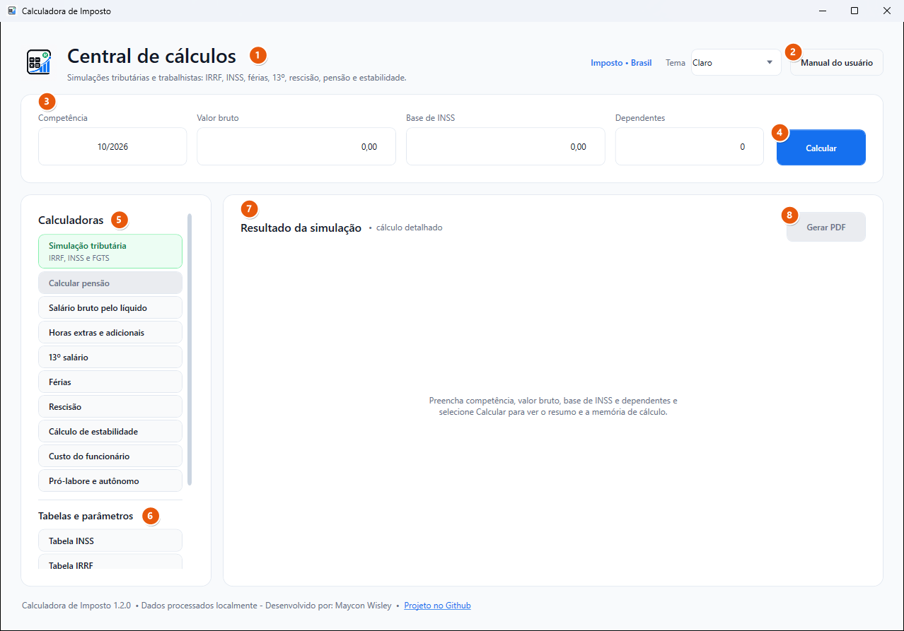

| Nº | Área | Para que serve |
| --- | --- | --- |
| 1 | Cabeçalho | Identifica a Central de cálculos. Ao lado ficam o seletor de **Tema** e o botão do manual. |
| 2 | Manual do usuário | Abre este manual. Também pode ser aberto com a tecla **F1** em qualquer janela. |
| 3 | Dados da simulação | Competência, valor bruto, base de INSS e quantidade de dependentes. |
| 4 | Calcular | Executa a simulação tributária com os dados informados. |
| 5 | Calculadoras | Acesso às demais calculadoras: estabilidade e pensão alimentícia. |
| 6 | Tabelas e parâmetros | Acesso às tabelas de INSS, IRRF e aos parâmetros usados nos cálculos. |
| 7 | Resultado da simulação | Mostra o resumo, o comparativo e a memória de cálculo depois de calcular. |
| 8 | Gerar PDF | Salva o resultado em um relatório PDF. Fica disponível depois do primeiro cálculo. |

Enquanto nenhum cálculo foi feito, a área de resultado exibe uma orientação sobre o que preencher.

## 4. Regras de preenchimento

Estas regras valem para todas as telas do aplicativo:

- **Competência:** informe mês e ano no formato **MM/AAAA**, por exemplo `10/2026`.
- **Datas:** informe no formato **dd/MM/aaaa**, por exemplo `02/10/2026`.
- **Valores em reais:** use vírgula para os centavos, como em `8500,00` ou `8.500,00`. O ponto de milhar é opcional.
- **Formatação automática:** ao entrar em um campo de valor que está zerado, ele é limpo para você digitar. Ao sair do campo, o valor é formatado com duas casas decimais (`8.500,00`). Se você deixar o campo vazio, ele volta para `0,00`.
- **Navegação:** use a tecla **Tab** para avançar entre os campos e **Shift + Tab** para voltar.

Se algum dado estiver em formato inválido, o aplicativo exibe um aviso e não faz o cálculo. Veja exemplos na seção [Mensagens e solução de problemas](#11-mensagens-e-solução-de-problemas).

## 5. Simulação tributária

### 5.1 Preenchendo os dados

1. Em **Competência**, confirme ou altere o mês de referência. As tabelas usadas no cálculo são as vigentes nessa competência.
2. Em **Valor bruto**, informe o total de rendimentos tributáveis do mês.
3. **Base de INSS** é preenchida automaticamente com o valor bruto. Altere somente se a base de contribuição for diferente do valor bruto.
4. Em **Dependentes**, informe a quantidade de dependentes para fins de IRRF (número inteiro, zero ou maior).
5. Clique em **Calcular**.

### 5.2 Lendo o resultado

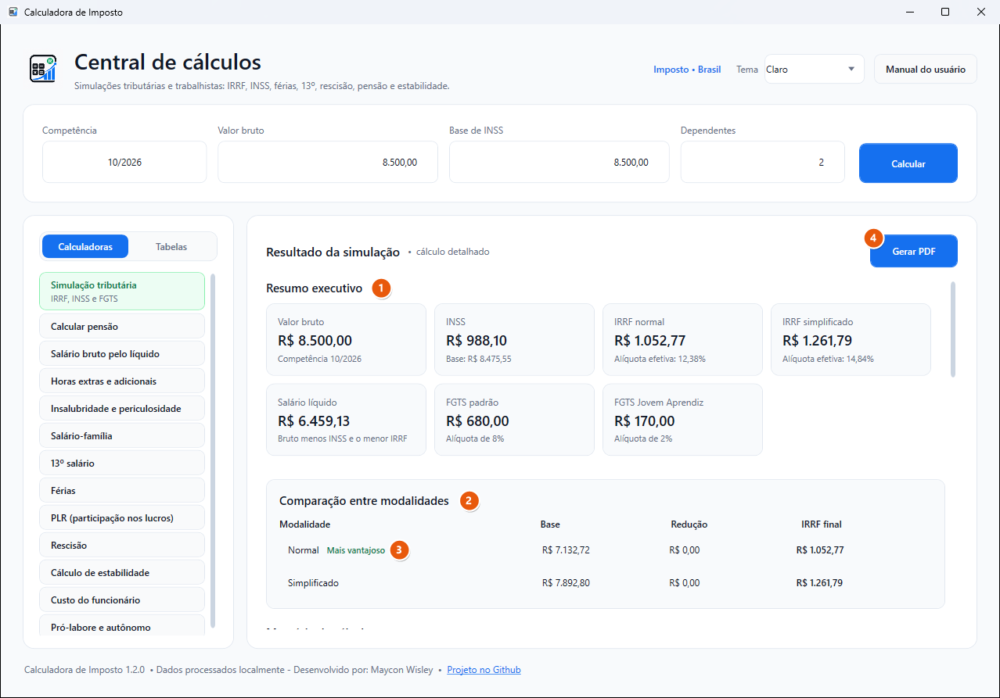

1. **Resumo executivo:** cartões com os principais valores. São eles o valor bruto, o INSS com a base considerada, o IRRF nas duas modalidades com a alíquota efetiva de cada uma e o FGTS de 8% e de 2%.
2. **Comparação entre modalidades:** base de cálculo, redução mensal e IRRF final da modalidade normal e da simplificada.
3. **Mais vantajoso:** destaca a modalidade com o menor IRRF. Quando as duas resultam no mesmo valor, nenhuma é destacada.
4. **Gerar PDF:** salva o resultado completo em um relatório.

Role a área de resultado para ver a **memória de cálculo**, que mostra passo a passo como cada valor foi obtido:

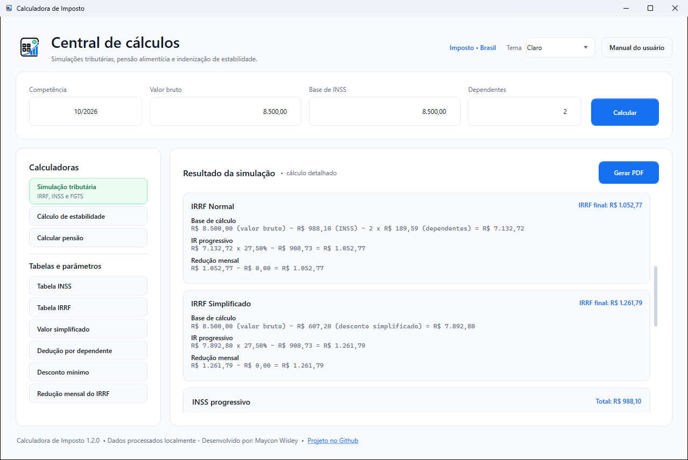

Para cada modalidade de IRRF são exibidos:

- **Base de cálculo:** o valor sobre o qual o imposto incide.
- **IR progressivo:** base × alíquota da faixa − parcela a deduzir.
- **Redução mensal:** desconto aplicado ao imposto, quando previsto para a competência.

No final da área de resultado aparece o detalhamento **faixa a faixa** do INSS e do IRRF:

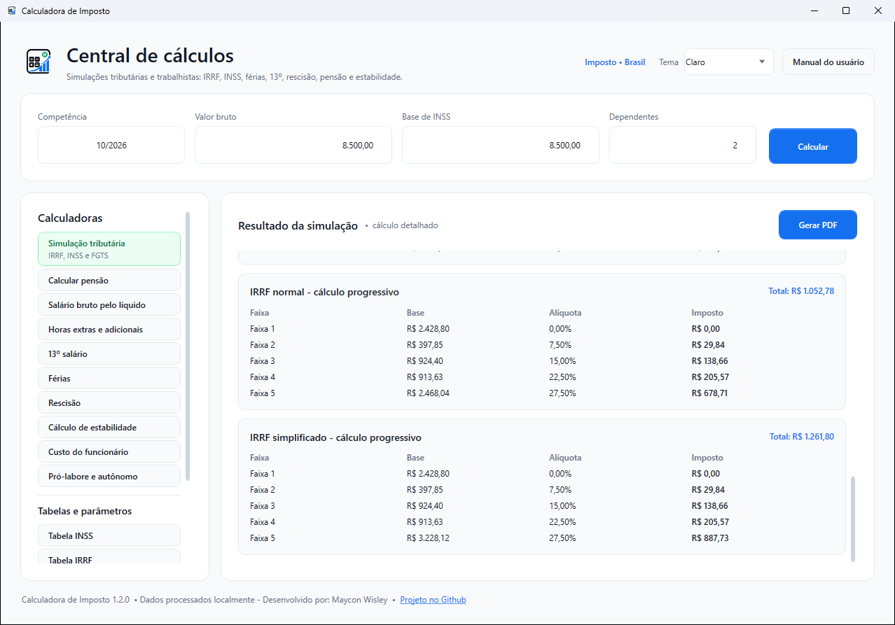

### 5.3 Como os valores são calculados

| Item | Regra aplicada pelo aplicativo |
| --- | --- |
| INSS | A partir de 03/2020, cálculo progressivo: cada parte da base é tributada pela alíquota da sua faixa. Antes de 03/2020, alíquota única conforme a faixa em que a base se encontra. A base é limitada ao teto da tabela (último limite cadastrado). |
| IRRF normal | Base = valor bruto − INSS − (dependentes × dedução por dependente). |
| IRRF simplificado | Base = valor bruto − desconto simplificado. Disponível a partir de 05/2023. |
| Redução mensal | Quando cadastrada para a competência, reduz o imposto apurado conforme a faixa de rendimentos (por exemplo, as regras vigentes a partir de 01/2026). |
| Alíquota efetiva | IRRF final ÷ valor bruto. |
| FGTS | 8% (padrão) e 2% (Jovem Aprendiz) sobre a base de INSS considerada na simulação. |

> **Importante:** o aplicativo utiliza, para cada tabela, o registro mais recente cuja competência seja **igual ou anterior** à competência informada. Por exemplo, uma simulação de 10/2026 usa as faixas de INSS de 01/2026, se essa for a tabela mais recente até essa data.

## 6. Cálculo de pensão alimentícia

O botão **Calcular pensão** fica disponível depois que você faz uma simulação tributária na tela principal. A pensão usa a competência, o valor bruto, a base de INSS e os dependentes informados na simulação.

### 6.1 Calculando

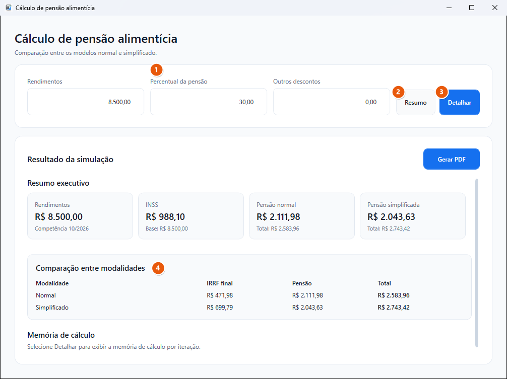

1. Em **Percentual da pensão**, informe o percentual definido em decisão ou acordo (de 0 a 100), por exemplo `30,00`.
2. **Resumo** calcula e mostra o resumo executivo e o comparativo entre as modalidades.
3. **Detalhar** faz o mesmo cálculo e inclui a memória de cálculo de cada iteração.
4. **Comparação entre modalidades:** IRRF final, pensão e total (IRRF + pensão) nas modalidades normal e simplificada.

O campo **Rendimentos** traz o valor bruto da simulação e não pode ser editado nesta tela. Em **Outros descontos**, informe valores que devem ser retirados dos rendimentos antes do cálculo; eles não podem ser maiores que os rendimentos.

### 6.2 Por que o cálculo é feito em iterações

A pensão alimentícia é dedutível da base do IRRF, mas o próprio IRRF reduz o valor sobre o qual a pensão é calculada. Por isso o aplicativo repete o cálculo até que o valor da pensão se estabilize, com diferença de até R$ 0,01 entre duas iterações. Em cada iteração:

1. A base do IRRF é recalculada descontando a pensão encontrada na iteração anterior.
2. O IRRF é apurado pela tabela progressiva e pela redução mensal, quando houver.
3. A base da pensão é calculada como rendimentos − INSS − IRRF.
4. A nova pensão é calculada aplicando o percentual sobre essa base.

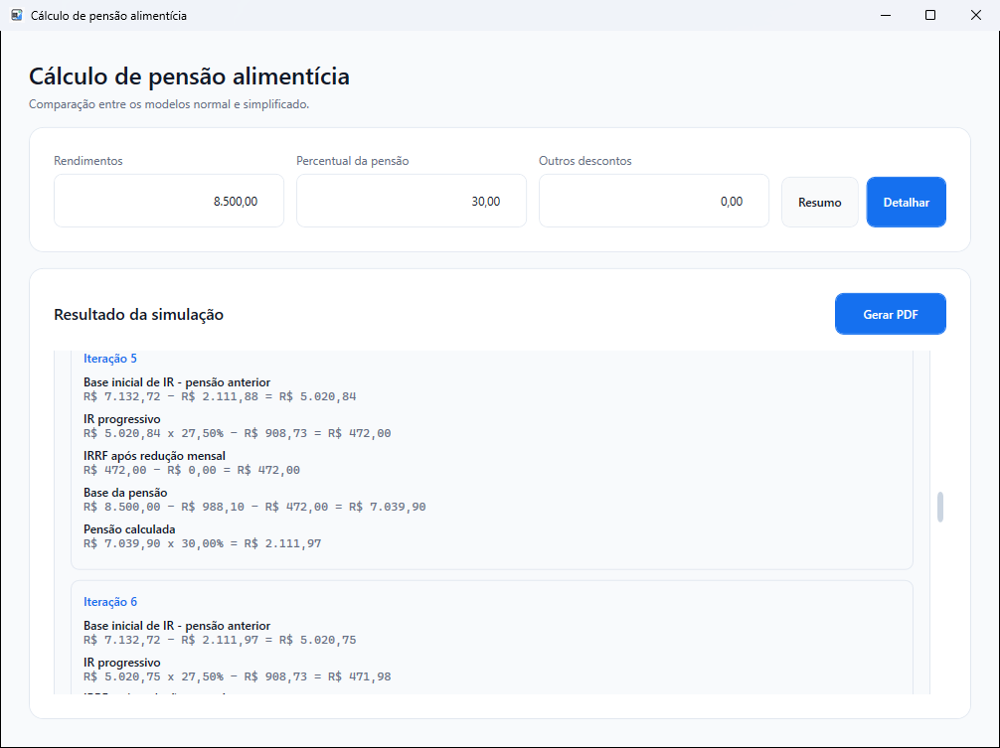

A modalidade mais vantajosa é a que resulta no **menor total** (IRRF + pensão).

## 7. Cálculo de estabilidade

Acesse **Cálculo de estabilidade** no menu **Calculadoras**.

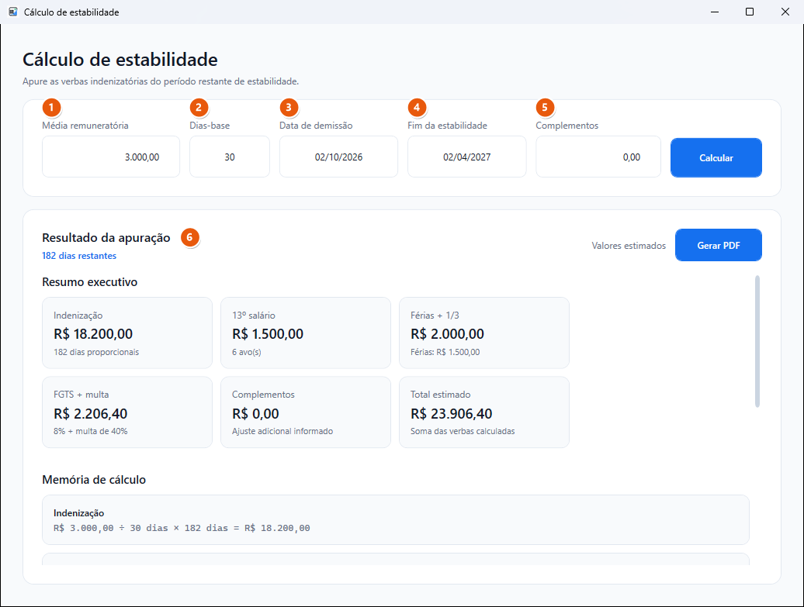

| Nº | Campo | O que informar |
| --- | --- | --- |
| 1 | Média remuneratória | Média da remuneração usada como referência para a indenização. |
| 2 | Dias-base | Divisor para obter o valor diário da média. O padrão é 30. |
| 3 | Data de demissão | Data do desligamento (dd/MM/aaaa). |
| 4 | Fim da estabilidade | Último dia do período de estabilidade (dd/MM/aaaa). Deve ser posterior à demissão. |
| 5 | Complementos | Valores adicionais a somar no total, se houver. |
| 6 | Resultado da apuração | Mostra, enquanto você digita as datas, quantos dias de estabilidade restam. |

Clique em **Calcular** para ver o resumo e a memória de cálculo:

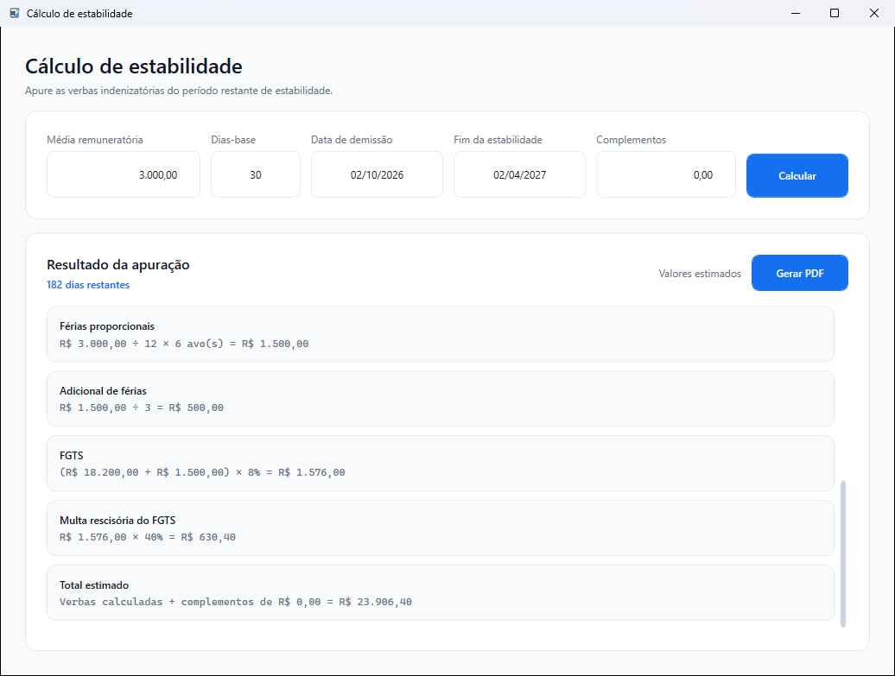

| Verba | Regra aplicada |
| --- | --- |
| Indenização | Média ÷ dias-base × dias de estabilidade. |
| Avos | Um avo a cada 30 dias de estabilidade, mais um avo quando a sobra for de 15 dias ou mais. |
| 13º salário | Média ÷ 12 × avos. |
| Férias proporcionais | Média ÷ 12 × avos. |
| Adicional de férias | Férias ÷ 3. |
| FGTS | (Indenização + 13º salário) × 8%. |
| Multa do FGTS | FGTS × 40%. |
| Total estimado | Soma das verbas + complementos. |

O botão **Gerar PDF** cria um demonstrativo com as verbas, os dados considerados e o **Total a receber**.

## 8. Tabelas e parâmetros

As tabelas definem as faixas e os valores usados em todos os cálculos. Elas já vêm preenchidas com o histórico desde 2017, e você pode consultá-las, corrigi-las, incluir novos períodos ou atualizá-las pela fonte oficial.

### 8.1 Conhecendo a janela de uma tabela

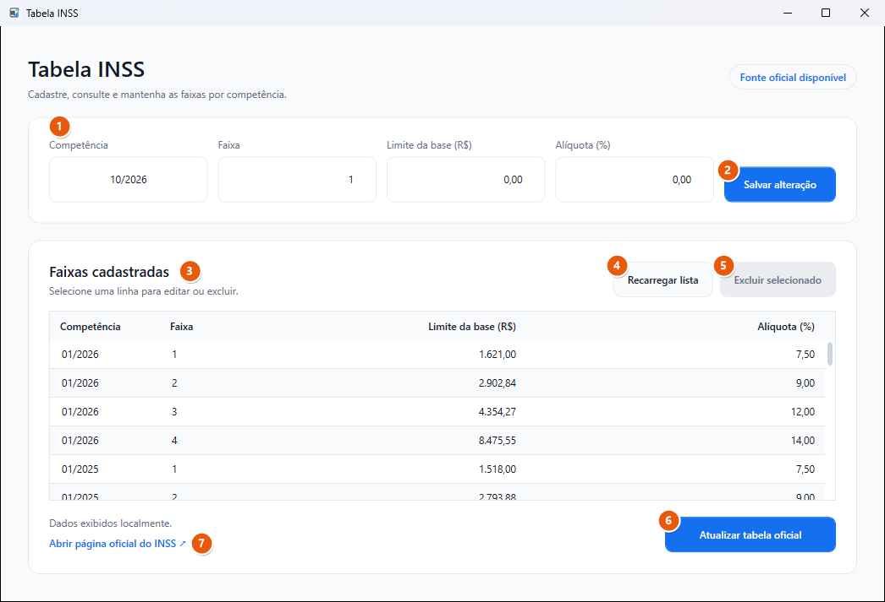

| Nº | Elemento | Função |
| --- | --- | --- |
| 1 | Formulário | Campos do registro: competência e os valores da tabela aberta. Só aparecem os campos que a tabela usa. |
| 2 | Salvar alteração | Grava o registro do formulário (veja a regra de inclusão e edição abaixo). |
| 3 | Lista de registros | Registros cadastrados, do mais recente para o mais antigo. |
| 4 | Recarregar lista | Lê novamente os registros do banco e **limpa a seleção**. |
| 5 | Excluir selecionado | Remove a linha selecionada. Fica desabilitado quando nenhuma linha está selecionada. |
| 6 | Atualizar tabela oficial | Busca a tabela vigente no site oficial e grava no banco local. |
| 7 | Abrir página oficial | Abre no navegador a página oficial usada na atualização. |

### 8.2 Incluindo, editando e excluindo registros

O botão **Salvar alteração** funciona de duas formas, conforme haja ou não uma linha selecionada:

- **Editar um registro:** clique na linha desejada. Os valores são copiados para o formulário. Altere o que for necessário e clique em **Salvar alteração**; o registro selecionado é atualizado.
- **Incluir um registro novo:** clique em **Recarregar lista** para limpar a seleção. Preencha o formulário e clique em **Salvar alteração**; um novo registro é criado.
- **Excluir:** selecione a linha e clique em **Excluir selecionado**.

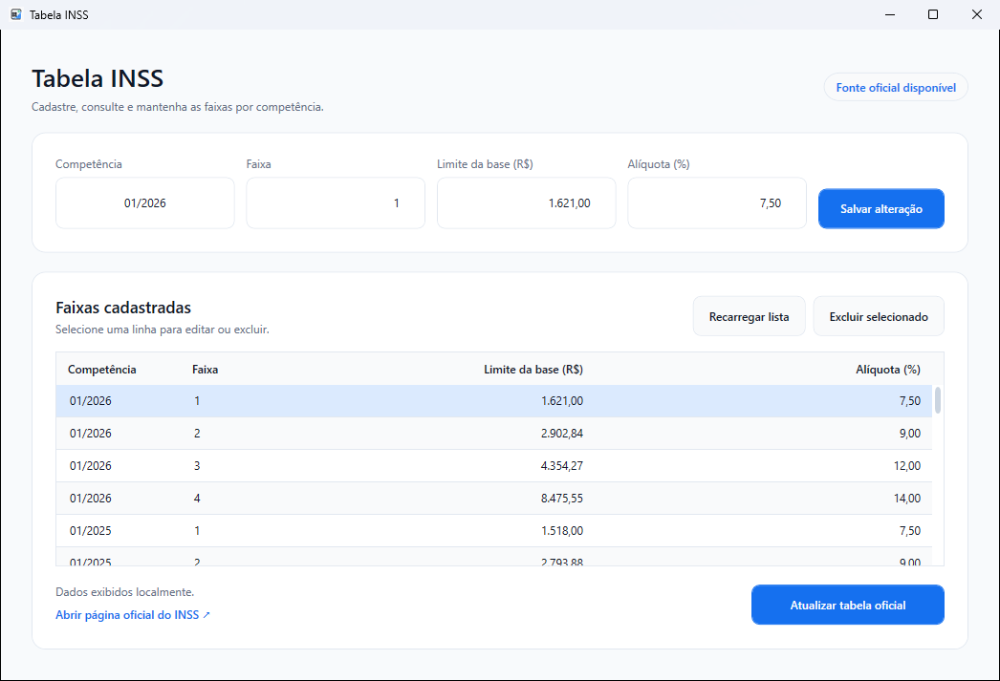

> **Atenção:** sem nenhuma linha selecionada, **Salvar alteração sempre inclui um registro novo**, mesmo que o formulário mostre valores de um registro existente. Isso acontece, por exemplo, depois de **Recarregar lista** ou de uma atualização oficial. Confira se a linha certa está destacada antes de salvar uma edição.

As alterações passam a valer imediatamente para os próximos cálculos.

### 8.3 Atualizando pela fonte oficial

Clique em **Atualizar tabela oficial** com o computador conectado à internet. O aplicativo consulta a página oficial, valida os valores encontrados e só então grava os dados. Ao final, a mensagem abaixo da lista informa a competência importada e a quantidade de faixas:

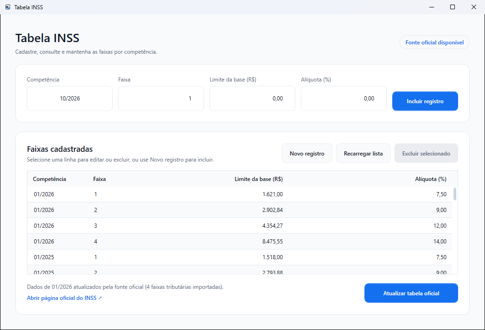

- **Tabela INSS:** a atualização usa a página de contribuição mensal do INSS (gov.br).
- **Tabela IRRF, Valor simplificado, Dedução por dependente e Redução mensal do IRRF:** a atualização usa a página de tabelas da Receita Federal. Por isso, em qualquer uma dessas telas, a atualização importa de uma só vez as faixas do IRRF, o desconto simplificado, a dedução por dependente e a redução mensal da competência publicada.
- **Desconto mínimo:** não possui atualização online; mantenha-o manualmente.

Se a página oficial estiver indisponível ou tiver mudado de formato, a atualização é cancelada **sem alterar nenhum dado local**, e uma mensagem explica o motivo.

### 8.4 As tabelas disponíveis

**Tabela INSS:** faixa, limite da base e alíquota de cada faixa por competência.

**Tabela IRRF:** faixa, limite da base, alíquota e parcela a deduzir. A última faixa usa um limite muito alto para representar "acima de".

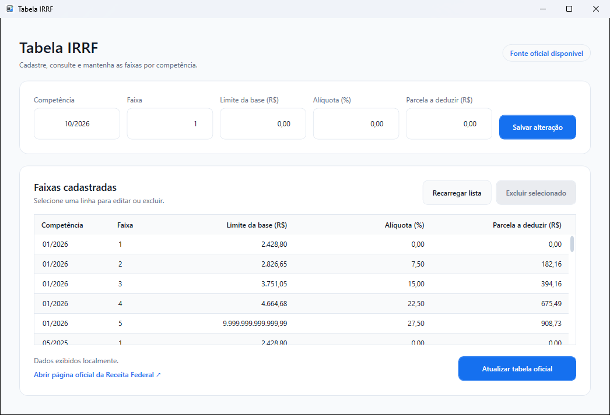

**Redução mensal do IRRF:** faixas de rendimentos com o multiplicador e o valor-base da redução aplicada ao imposto. Nas regras vigentes a partir de 01/2026, por exemplo:

- rendimentos de até R$ 5.000,00 têm redução de até R$ 312,89;
- de R$ 5.000,01 a R$ 7.350,00, a redução é de R$ 978,62 − 0,133145 × rendimentos.

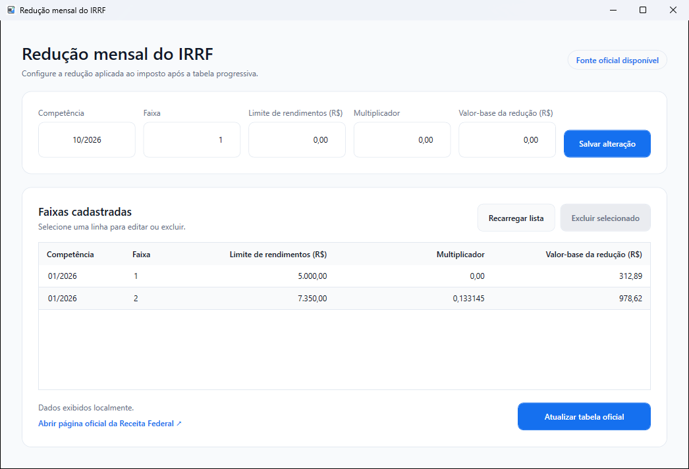

**Valor simplificado, Dedução por dependente e Desconto mínimo:** um único valor por competência.

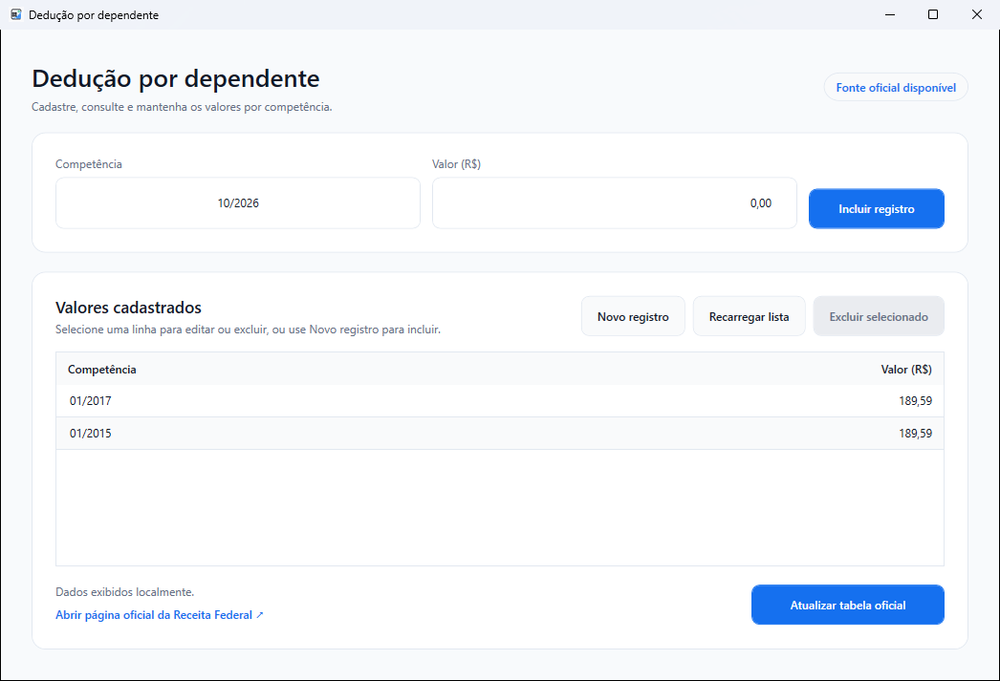

> **Dica:** antes de grandes alterações, faça uma cópia de segurança do arquivo **BancoDados\calculoIrrf.db** com o aplicativo fechado.

## 9. Relatórios em PDF

As três calculadoras possuem o botão **Gerar PDF**, que fica disponível depois do primeiro cálculo. Ao clicar, escolha a pasta e o nome do arquivo. O aplicativo sugere um nome com a competência ou a data:

| Calculadora | Nome sugerido | Conteúdo |
| --- | --- | --- |
| Simulação tributária | `relatorio-simulacao-tributaria-MM-AAAA.pdf` | Dados considerados, comparativo do IRRF, memória de cálculo e detalhamento por faixas. |
| Pensão alimentícia | `relatorio-pensao-alimenticia-MM-AAAA.pdf` | Dados considerados, comparativo dos modelos e, se o último cálculo foi feito com **Detalhar**, as iterações. |
| Estabilidade | `demonstrativo-estabilidade-AAAA-MM-DD.pdf` | Verbas da indenização, dados considerados e total a receber. |

O relatório sempre reflete o **último cálculo** feito na tela.

## 10. Tema e configurações

No canto superior direito da tela principal, escolha o **Tema**:

- **Automático:** acompanha o tema claro ou escuro configurado no Windows.
- **Claro** ou **Escuro:** mantém sempre a aparência escolhida.

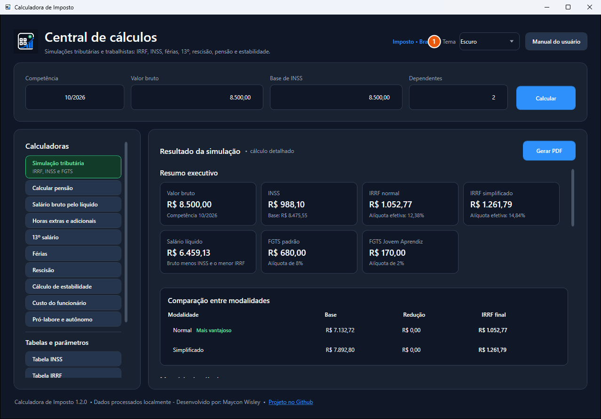

A escolha é salva automaticamente e restaurada na próxima abertura. As configurações ficam no arquivo `%LOCALAPPDATA%\CalculoIRRF\settings.json`.

Por padrão, o aplicativo desenha a interface sem usar a placa de vídeo, o que reduz bastante o consumo de memória. Se preferir a aceleração por GPU, feche o aplicativo e altere no arquivo de configurações o valor `"HardwareAcceleration": false` para `true`.

## 11. Mensagens e solução de problemas

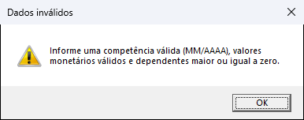

| Mensagem ou situação | O que fazer |
| --- | --- |
| "Informe uma competência válida (MM/AAAA), valores monetários válidos e dependentes maior ou igual a zero." | Confira o formato da competência, use vírgula nos centavos e informe dependentes como número inteiro. |
| "Informe média, dias-base, datas (dd/MM/aaaa) e complementos em formatos válidos." | Confira as datas da estabilidade e os valores digitados. |
| Aviso de que o fim da estabilidade deve ser posterior à data de demissão | Corrija a data final, que precisa ser depois da demissão. |
| "Informe valores monetários válidos." (pensão) | Confira o percentual e os outros descontos. |
| "Os parâmetros da pensão são inválidos." | O percentual deve estar entre 0 e 100, e os outros descontos não podem superar os rendimentos. |
| "Não há dados de INSS cadastrados para a competência informada." (ou de IRRF e demais tabelas) | Não existe tabela vigente para a competência. Informe uma competência a partir de 01/2017 ou cadastre a tabela correspondente. |
| "Informe valores válidos para competência e campos numéricos." | Na manutenção de tabelas, confira a competência (MM/AAAA), a faixa (inteiro maior que zero) e os valores. |
| "Não foi possível atualizar a tabela pelo site oficial." | Verifique a conexão com a internet e tente novamente mais tarde. Os dados locais não foram alterados. Se persistir, a página oficial pode ter mudado de formato: cadastre os valores manualmente. |
| O botão **Calcular pensão** está desabilitado | Faça primeiro uma simulação tributária na tela principal. |
| O botão **Gerar PDF** está desabilitado | Faça um cálculo na tela antes de gerar o relatório. |
| "Não foi possível gerar o relatório em PDF." | Escolha outra pasta, verifique se o arquivo não está aberto em outro programa e se há permissão de gravação. |
| O manual não abre pelo botão | O aplicativo tenta abrir o PDF com o leitor padrão do Windows e, se não conseguir, a versão on-line no GitHub. Instale um leitor de PDF ou verifique a conexão. |

## 12. Perguntas frequentes

**Os meus dados são enviados para a internet?**
Não. Os cálculos e as tabelas ficam no seu computador. A internet só é usada quando você clica em **Atualizar tabela oficial** ou em links para páginas oficiais.

**Por que o total das faixas do IRRF difere em centavos do IRRF final?**
No detalhamento por faixas, o imposto de cada faixa é arredondado separadamente. O IRRF final é calculado pela fórmula da tabela progressiva (base × alíquota − parcela a deduzir). Por isso pode haver diferença de alguns centavos entre os dois.

**Por que o desconto simplificado aparece zerado em competências antigas?**
O desconto simplificado mensal passou a valer a partir de 05/2023. Em competências anteriores, apenas a modalidade normal é aplicável.

**A base de INSS mostrada é menor que a que eu informei. Está errado?**
Não. Quando a base ultrapassa o teto da tabela do INSS, o cálculo é limitado ao teto, e o cartão do INSS mostra a base efetivamente considerada.

**Alterei uma tabela. Preciso reiniciar o aplicativo?**
Não. A alteração vale para o próximo cálculo.

**Como volto aos valores originais de uma tabela?**
Use **Atualizar tabela oficial**, quando disponível, ou corrija os valores manualmente. Ter uma cópia de segurança do arquivo `BancoDados\calculoIrrf.db` permite restaurar o estado anterior.

## 13. Atalhos de teclado

| Tecla | Ação |
| --- | --- |
| **F1** | Abre este manual, em qualquer janela do aplicativo. |
| **Tab** / **Shift + Tab** | Avança ou volta entre os campos. |
| **Espaço** ou **Enter** com um botão selecionado | Aciona o botão. |
| **Alt + F4** | Fecha a janela atual. |

---

*Calculadora de Imposto — processamento local. Projeto no GitHub: [mayconwisley/CalculoIRRF](https://github.com/mayconwisley/CalculoIRRF).*
